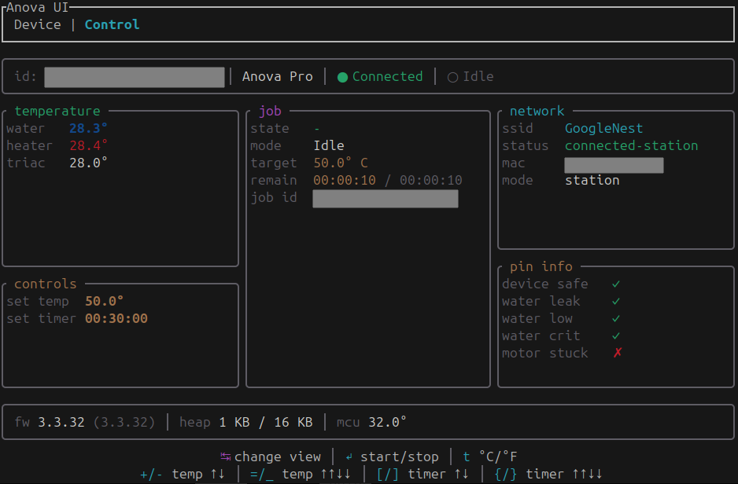

# anova_rs

A TUI for monitoring and controlling one or multiple ANOVA precision cookers. Inspired by the original ANOVA [developer-project-wifi](https://github.com/anova-culinary/developer-project-wifi).

[](https://ratatui.rs/)

## Installation
The easiest way to get started is to download a binary from the [GitHub release page](https://github.com/OscarAspelin95/anova_rs/releases). Alternatively, clone the respository and run:

```bash
cargo build --release
```

## Usage
`anova_rs` requires a personal Anova token obtained from the [Anova Oven](https://play.google.com/store/apps/details?id=com.anovaculinary.anovaoven) app. The token can be provided through:
- A .env file, containing `ANOVA_TOKEN="anova-ey........"`. Automatically detected on launch.
- An environment variable `export ANOVA_TOKEN="anova-ey........"`
- The CLI via the `--anova-token` arg.

```bash
Usage: anova-rs [OPTIONS]

Options:
  -l, --log-file <LOG_FILE>        where to output log file. [default: log.txt]
  -a, --anova-token <ANOVA_TOKEN>  anova token
  -h, --help                       Print help
```

## Supported Devices
`anova_rs` uses the Anova APC API and currently only supports precision cooker devices. The honest reason is that I don't own a precision oven hence making development, testing and validation difficult.

## License
Copyright (c) Oscar Aspelin <oscar.aspelin@gmail.com>
This project is licensed under the MIT license ([LICENSE] or <http://opensource.org/licenses/MIT>)
[LICENSE]: ./LICENSE

## Current State
This project is still in very early development so expect things to change. The priority list is as follows:
- [ ] Bugfixes. There is a few I know of and more will probably appear.
- [ ] Add tests. There are currently NO tests at all.
- [ ] UI tweaks. Change some colors, make the control more ergonomic.
- [ ] Temperature plot. A line plot of the current temperature -> target tempreature.
- [ ] Move the APC API to a separate crate.


